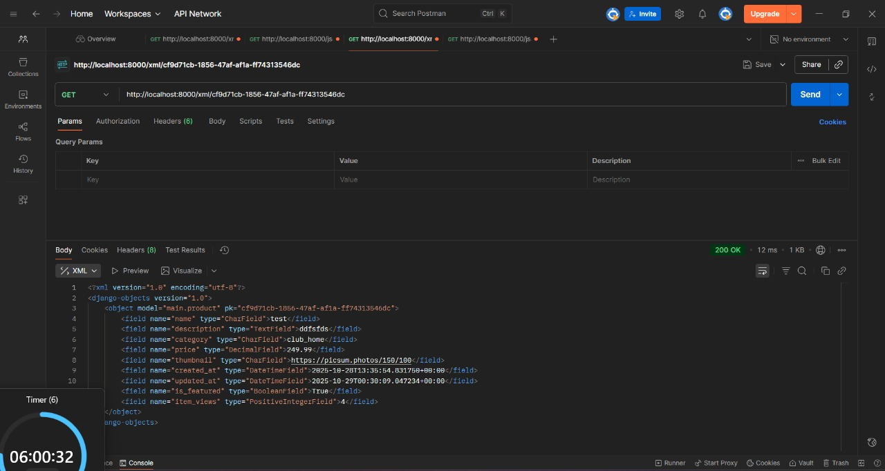
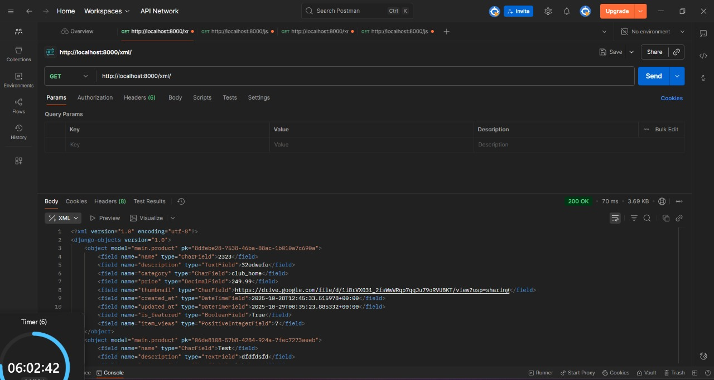
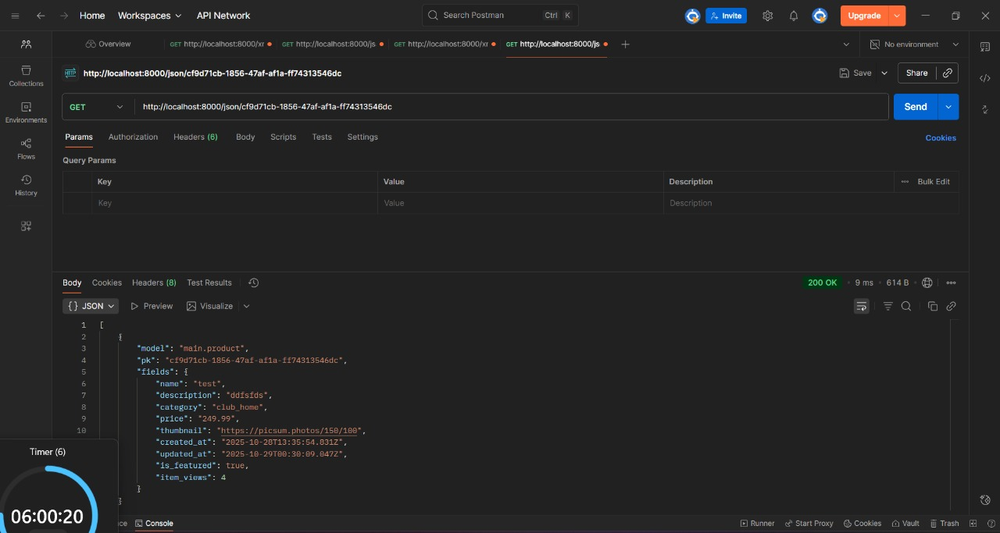
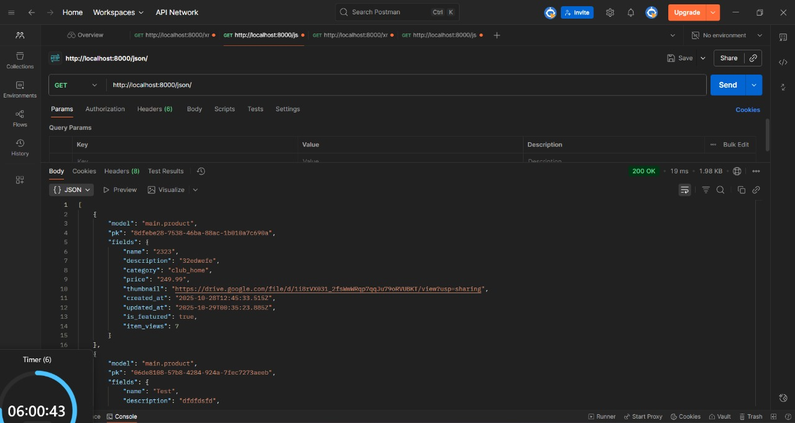
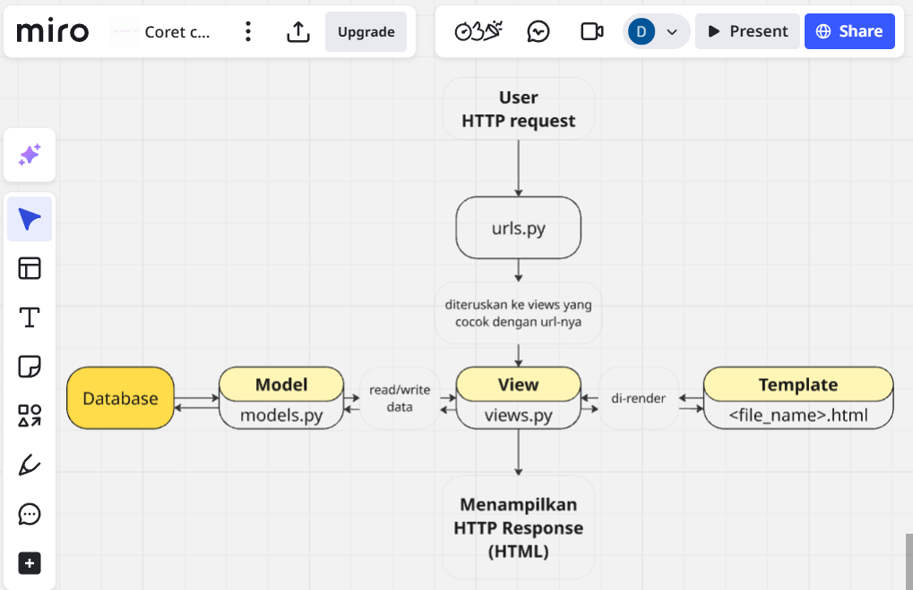

## Tugas Individu - PBP C
### Deltakristiano Kurniaputra - NPM: 2406425810
#### Link Deployment: https://deltakristiano-kurniaputra-nextjersey.pbp.cs.ui.ac.id/


<details><summary>Tugas 6: Javascript dan AJAX
</summary>

## **Q1:** Apa perbedaan antara synchronous request dan asynchronous request?

Pada request synchronous, client mengirim permintaan ke server dan aplikasi akan berhenti beroperasi hingga respons diterima dan diproses. Berbeda dengan asynchronous, di mana client dapat langsung melanjutkan proses lainnya setelah mengirim permintaan tanpa perlu menunggu respons server. Respons tersebut akan dihandle naantinya, melalui callback atau promise.

---

## **Q2:** Bagaimana AJAX bekerja di Django (alur request–response)?

Javascript di client mengirimkan request (GET/POST) ke server Django, kemudian Django routing system mengarahkan request tersebut ke view yang tepat untuk diproses. View kemudian mengolah request, mengambil data dari database jika diperlukan, dan mengembalikan hasilnya dalam bentuk JSON atau HTML. Terakhir, respons diterima oleh AJAX untuk melakukan update pada elemen halaman tertentu tanpa refresh keseluruhan.

---

## **Q3:** Apa keuntungan menggunakan AJAX dibandingkan render biasa di Django?

1. hanya data yang dibutuhkan yang ditransfer (bukan seluruh halaman), menghemat bandwidth dan mempercepat response time. 
2. format data yang "padet" seperti JSON mengurangi beban jaringan dan server. 
3. interaksi pengguna menjadi lebih lancar karena tidak ada delay untuk refresh halaman. 
4. konten dapat diperbarui secara real-time sehingga aplikasi terasa lebih dinamis dan responsif.

---

## **Q4:** Bagaimana cara memastikan keamanan saat menggunakan AJAX untuk fitur Login dan Register di Django?

Memakai HTTPS untuk mengenkripsi komunikasi data, menyertakan CSRF token pada setiap POST request, lakukan validasi dan sanitasi input di server untuk mencegah SQL injection dan serangan sejenis, manfaatkan sistem autentikasi bawaan Django untuk pengelolaan session, hindari mengirimkan data sensitif (password) dalam respons, dan terapkan rate limiting pada login attempts untuk mencegah brute force attack.

---

## **Q5:** Bagaimana AJAX mempengaruhi pengalaman pengguna (User Experience) pada website?

 AJAX secara signifikan meningkatkan user experience dengan menciptakan interaksi yang lebih cepat dan responsif. Pengguna dapat melakukan berbagai aksi seperti submit form, load konten tambahan, atau update bagian spesifik dari halaman tanpa harus menunggu refresh halaman keseluruhan. Hal ini mengurangi waktu tunggu dan memberikan kesan bahwa aplikasi web bekerja secara real-time dan interaktif.

---

## Checklist Tugas
- [X] Mengubah fitur - fitur tugas sebelumnya menggunakan AJAX
  - [X] Fitur CRUD (Create Read Update Delete) product menggunakan AJAX (tidak boleh menggunakan dari context render kecuali untuk keperluan AJAX)
  - [X] Mengubah Login dan Register menggunakan AJAX.
- [X] Tampilan baru
  - [X] Membuat tombol yang akan menampilkan modal untuk create dan update product dalam bentuk form.
  - [X] Membuat modal konfirmasi saat pengguna ingin menghapus product
  - [X] Saat melakukan aksi dari modal, product akan di-refresh tanpa perlu melakukan reload halaman (Refresh melalui browser).
  - [X] Membuat tombol refresh yang akan menampilkan list product terbaru tanpa perlu reload halaman (Refresh melalui browser)
  - [X] Membuat Loading, Empty, dan Error state melalui Javascript.
  - [X] Menampilkan Toast saat create, update, atau delete product dan saat login, logout, dan register (tidak boleh sama persis dengan tutorial).
- [X] Menjawab beberapa pertanyaan berikut pada README.md pada root folder (silakan modifikasi README.md yang telah kamu buat sebelumnya; tambahkan subjudul untuk setiap tugas).
  - [X] Apa perbedaan antara synchronous request dan asynchronous request?
  - [X] Bagaimana AJAX bekerja di Django (alur request–response)?
  - [X] Apa keuntungan menggunakan AJAX dibandingkan render biasa di Django?
  - [X] Bagaimana cara memastikan keamanan saat menggunakan AJAX untuk fitur Login dan Register di Django?
  - [X] Bagaimana AJAX mempengaruhi pengalaman pengguna (User Experience) pada website?
- [X] Melakukan add-commit-push ke GitHub.
</details>


<details><summary>Tugas 5: Desain Web menggunakan HTML, CSS dan Framework CSS</summary>

---

## **Q1:** Bagaimana cara browser menentukan gaya mana yang harus diterapkan ketika ada beberapa CSS rule yang mengatur elemen yang sama?

Browser mengikuti sistem hierarki untuk menyelesaikan konflik CSS. Aturan dengan deklarasi `!important` akan selalu menang, melayani sebagai pengecualian terhadap semua prioritas lainnya.

```css
p { color: blue !important; }
```

Setelahnya, gaya inline yang didefinisikan langsung di atribut `style` elemen akan mengalahkan CSS yang dimuat dari file eksternal atau bagian `<style>` di HTML.

```html
<p style="color: red;">Teks</p>
```

Kemudian selector ID (`#`) memiliki bobot yang lebih kuat daripada class atau selector lainnya. Selector class, atribut, dan pseudo-class memiliki prioritas menengah, lebih tinggi dari elemen biasa tetapi lebih rendah dari ID.

```css
#header { color: blue; }
.teks { color: green; }
[type="text"] { ... }
p:hover { ... }
```

Selector elemen dasar (tag HTML) memiliki bobot paling rendah dalam hirarkhi.

```css
p { color: black; }
p::first-letter { ... }
```

Ketika dua rule memiliki spesifisitas yang sama, CSS yang terakhir kali diproses (paling bawah dalam file atau yang paling terakhir dimuat) akan diterapkan. Kombinasi selector juga meningkatkan spesifisitas secara keseluruhan.

---

## **Q2:** Mengapa adaptabilitas perangkat menjadi pertimbangan krusial dalam membangun aplikasi web modern, dan apa dampaknya terhadap pengalaman pengguna?

Saat ini, pengguna mengakses web melalui beragam perangkat dengan ukuran layar yang sangat berbeda-beda. Desain yang responsif memastikan bahwa layout, typografi, dan elemen interaktif dapat beradaptasi secara otomatis terhadap berbagai dimensi layar, mulai dari smartphone hingga monitor desktop. Tanpa adaptabilitas ini, pengguna akan mengalami pengalaman yang buruk, seperti konten yang terpotong, navigasi yang sulit digunakan, atau text yang terlalu kecil untuk dibaca.

Situs seperti YouTube dan Laman PBP 25/26 menunjukkan implementasi yang baik dari konsep ini. Mereka secara dinamis mengatur posisi dan ukuran komponen sesuai dengan perangkat yang digunakan, memungkinkan navigasi yang intuitif di layar apa pun. Pengguna dapat dengan mulus berpindah dari desktop ke mobile tanpa kehilangan fungsionalitas.

Sebaliknya, platform seperti SiakNG masih menggunakan layout tetap yang tidak beradaptasi dengan ukuran viewport. Pada perangkat mobile, pengguna dipaksa untuk melakukan pinch-zoom atau horizontal scrolling yang melelahkan, mengurangi accessibility dan kepuasan pengguna secara signifikan.

---

## **Q3:** Apa peran masing-masing dari margin, border, dan padding dalam mengatur spacing pada elemen HTML?

Ketiga properti ini bekerja dalam layer berbeda untuk mengontrol ruang di sekitar konten elemen.

Margin: mengatur jarak di luar batas elemen. Fungsinya adalah menciptakan ruang antara elemen tersebut dengan elemen-elemen tetangga. Margin dapat dikonfigurasi secara individual untuk setiap sisi atau diterapkan sekaligus ke semua arah.

```css
.element {
  margin: 20px; /* Semua sisi */
  margin-top: 10px;
  margin-right: 15px;
  margin-bottom: 10px;
  margin-left: 15px;
}
```

Border: garis pembatas yang membentuk kerangka visual elemen, berada di antara padding dan margin. Border dapat dikustomisasi dalam hal ketebalan, gaya (solid, dashed, dotted), dan warna, serta dapat memiliki sudut yang melengkung.

```css
.element {
  border: 2px solid black;
  border-top: 1px dashed red;
  border-radius: 5px;
}
```

Padding: ruang di dalam border, antara konten sebenarnya dengan garis tepi elemen. Padding memberikan "napas" visual kepada konten, membuatnya tidak terasa sesak. Seperti margin, padding dapat disesuaikan per sisi.

```css
.element {
  padding: 15px; /* Semua sisi */
  padding-top: 10px;
  padding-right: 20px;
  padding-bottom: 10px;
  padding-left: 20px;
}
```


Source: [Hostinger](https://www.hostinger.com/my/tutorials/padding-vs-margin)

---

## **Q4:** Bandingkan Flexbox dan Grid Layout: kapan sebaiknya menggunakan masing-masing, dan apa keunggulan karakteristik mereka?

Flexbox: model layout satu dimensi yang ideal untuk mengatur item secara berurutan dalam satu garis (horizontal atau vertikal). Flexbox unggul dalam mengontrol alignment, justification, dan distribusi ruang di sepanjang satu axis. Ini sangat berguna untuk navbar, button groups, atau list items yang perlu tersebar dengan konsisten.

```css
.container {
  display: flex;
  justify-content: center; /* Pemusatan horizontal */
  align-items: center; /* Pemusatan vertikal */
}
```

Grid Layout: model dua dimensi yang memberikan kontrol simultan atas baris dan kolom. Grid cocok untuk struktur halaman yang kompleks, seperti dashboard dengan header, sidebar, dan content area, atau gallery dengan banyak item yang terorganisir dalam baris dan kolom. Grid juga lebih fleksibel untuk membuat tata letak yang asymmetris dan responsif pada skala besar.

```css
.container {
  display: grid;
  grid-template-columns: repeat(3, 1fr);
  gap: 10px;
}
```

Pilih Flexbox untuk layout linear dan component-level arrangement. Pilih Grid untuk layout global halaman atau struktur multi-dimensional yang membutuhkan kontrol presisi pada positioning.

---

## **Q5:** Jelaskan pendekatan praktis yang kamu ambil dalam menyelesaikan tugas desain ini dengan cara sistematis dan terstruktur.

Mirip seperti pengerjaan Tugas-tugas sebelumnya, saya mulai dengan tutorial dan bertanya kepada LLM (read: chatgpt/claude) untuk meningkatkan pemahaman dan bertanya hal yang membingungkan selama pengerjaan tugas ini. Step saya dalam pemenuhan checklist adalah seperti ini:

1. Mengembangkan fitur backend terlebih dahulu dengan mengimplementasikan logic untuk delete dan edit product di `views.py`, kemudian mendaftarkan routing endpoint baru di `urls.py`.
2. Menerapkan styling framework modern ke template HTMLa untuk meningkatkan visual design.
3. Mengonfigurasi Django static files system agar file CSS eksternal dan aset-aset lainnya dapat diakses dan dimuat dengan benar oleh browser.
4. Mendokumentasikan pemahaman dan penjelasan teknis melalui file `README.md`.
5. Melakukan version control dengan git commit dan mendeploy hasil akhir ke platform PWS.

---
## Checklist untuk tugas ini adalah sebagai berikut:

- [X] Implementasikan fungsi untuk menghapus dan mengedit **product**.

- [X] Kustomisasi desain pada *template* HTML yang telah dibuat pada tugas-tugas sebelumnya menggunakan CSS atau CSS *framework* (seperti Bootstrap, Tailwind, Bulma) dengan ketentuan sebagai berikut:
  - [X] Kustomisasi halaman **login**, **register**, tambah **product**, edit **product**, dan detail **product** semenarik mungkin.
  - [X] Kustomisasi halaman daftar **product** menjadi lebih menarik dan *responsive*. Kemudian, perhatikan kondisi berikut:
    - [X] Jika pada aplikasi belum ada **product** yang tersimpan, halaman daftar **product** akan menampilkan gambar dan pesan bahwa belum ada **product** yang terdaftar.
    - [X] Jika sudah ada **product** yang tersimpan, halaman daftar **product** akan menampilkan detail setiap **product** dengan menggunakan *card* (tidak boleh sama persis dengan desain pada Tutorial!).
    - [X] Untuk setiap *card product*, buatlah dua buah *button* untuk mengedit dan menghapus **product** pada *card* tersebut!
  - [X] Buatlah *navigation bar* (navbar) untuk fitur-fitur pada aplikasi yang *responsive* terhadap perbedaan ukuran *device*, khususnya *mobile* dan *desktop*.
- [X] Menjawab beberapa pertanyaan berikut pada `README.md` pada *root folder* (silakan modifikasi `README.md` yang telah kamu buat sebelumnya; tambahkan subjudul untuk setiap tugas).
  - [X] Jika terdapat beberapa CSS selector untuk suatu elemen HTML, jelaskan urutan prioritas pengambilan CSS selector tersebut!
  - [X] Mengapa *responsive design* menjadi konsep yang penting dalam pengembangan aplikasi *web*? Berikan contoh aplikasi yang sudah dan belum menerapkan *responsive design*, serta jelaskan mengapa!
  - [X] Jelaskan perbedaan antara *margin*, *border*, dan *padding*, serta cara untuk mengimplementasikan ketiga hal tersebut!
  - [X] Jelaskan konsep *flex box* dan *grid layout* beserta kegunaannya!
  - [X] Jelaskan bagaimana cara kamu mengimplementasikan *checklist* di atas secara *step-by-step* (bukan hanya sekadar mengikuti tutorial)!

- [X] Melakukan `add-commit-push` ke GitHub.
</details>

<details><summary>Tugas 4: Implementasi Autentikasi, Session, dan Cookies pada Django</summary>


---
## **Q1:** Apa itu `Django AuthenticationForm`? Jelaskan juga kelebihan dan kekurangannya.

`AuthenticationForm` adalah komponen form autentikasi bawaan Django yang dirancang khusus untuk memfasilitasi proses login pengguna dengan cara yang aman dan efisien.

Kelebihan:

- Bisa langsung dipakai "off the shelf". Form ini dapat langsung diintegrasikan ke dalam aplikasi Django tanpa memerlukan konfigurasi yang rumit untuk classic common login.
Dari perspektif keamanan, Django telah membangun mekanisme perlindungan yang solid di dalam form ini. Sistem hashing password otomatis dan validasi kredensial pengguna sudah tertanam, sehingga meminimalkan potensi kerentanan keamanan umum dalam proses autentikasi.

- Selain itu, juga sudah terintegrasi dengan baik terhadap ekosistem Django. Hal ini memungkinkan sinkronisasi yang baik dengan session management, middleware, dan decorator seperti `@login_required`.
Ini juga memberikan pengalaman pengguna yang lebih baik dengan pesan error yang jelas dan informatif ketika terjadi kesalahan pada username atau password.

Kekurangan: 

- Fleksibilitas kustomisasi kurang karena off the shelf. Misalnya ketika membutuhkan fitur autentikasi yang lebih spesifik, seperti login berbasis email, OTP (One-Time Password), atau integrasi social login yang semuanya memerlukan form kustom.

- Desain visual juga belum bawaan. Karena tanpa styling bawaan, mengharuskan kita developer untuk menambahkan styling CSS dan desain UI sendiri.

- Fitur-fitur keamanan yang lebih advanced seperti two-factor authentication (2FA), CAPTCHA, atau rate limiting untuk mencegah brute force attack perlu diimplementasikan secara manual dan terpisah.
  
---
## **Q2:** Apa perbedaan antara autentikasi dan otorisasi? Bagaiamana Django mengimplementasikan kedua konsep tersebut?

Autentikasi: proses verifikasi identitas user untuk memastikan mereka adalah siapa yang mereka klaim melalui validasi kredensial seperti username dan password.

Otorisasi: menentukan hak akses pengguna, apa saja yang mereka bisa akses/lakukan, setelah autentikasi berhasil.

Django mengimplementasikan kedua konsep tersebut melalui modul `django.contrib.auth`. Untuk autentikasi, Django menyediakan `AuthenticationForm` dan middleware yang mengelola validasi sesi pengguna secara otomatis. 
Untuk otorisasi, Django menggunakan sistem izin berbasis role, pengelompokan grup, dan decorator seperti `@login_required` dan `@permission_required` untuk mengontrol akses terhadap view dan resource berdasarkan izin pengguna.

---
## **Q3:** Apa saja kelebihan dan kekurangan session dan cookies dalam konteks menyimpan state di aplikasi web?

Cookies:

- Keunggulan: Cookies disimpan langsung di browser pengguna, mengurangi beban pada server. Selama pengaturan tanggal expired tepat, cookies dapat mempertahankan data user lintas session browser. Aksesibilitas dari klien juga mudah melalui JavaScript, memberikan fleksibilitas dalam manipulasi data di front end.

- Kekurangan: Kapasitas penyimpanan terbatas hanya sekitar 4KB per cookie. Keamanan juga menjadi risiko karena cookies rentan terhadap manipulasi dan serangan seperti XSS atau CSRF jika tidak dienkripsi atau di-sign dengan baik. Setiap request HTTP mengirimkan cookies ke server, menambah overhead jaringan. Selain itu, pengguna atau browser dapat memblokir cookies berdasarkan pengaturan privasi mereka.

Session:

- Kelebihan: Data session disimpan di server, memberikan keamanan yang jauh lebih tinggi dan meminimalkan risiko manipulasi oleh pengguna. Session juga mendukung penyimpanan data dalam jumlah yang lebih besar dan lebih kompleks dibandingkan cookies, cocok untuk informasi sensitif atau terstruktur.

- Kekurangan: Setiap session memerlukan alokasi memori atau storage backend di server, meningkatkan beban infrastruktur terutama dengan jumlah pengguna aktif yang besar. Session memiliki waktu hidup yang relatif pendek dan tidak bertahan antar browser tanpa konfigurasi khusus. Session masih bergantung pada session ID yang umumnya disimpan dalam cookie untuk melacak identitas pengguna, sehingga tetap memiliki beberapa kerentanan inherited dari cookies.

---
## **Q4:** Apakah penggunaan cookies aman secara default dalam pengembangan web, atau apakah ada risiko potensial yang harus diwaspadai? Bagaimana Django menangani hal tersebut?

Cookies tidak aman secara default karena disimpan di browser pengguna dan rentan terhadap berbagai serangan. Risiko utama meliputi manipulasi cookie di mana pengguna dapat mengubah nilai cookie, session hijacking ketika penyerang mencuri session ID untuk mengakses akun pengguna, dan serangan XSS yang memungkinkan attacker membaca atau mengubah cookie melalui kode JavaScript berbahaya.

Django menerapkan beberapa lapisan perlindungan untuk mengamankan cookies. Signed cookies memastikan integritas data dengan mendeteksi jika cookie telah dimodifikasi. Flag HttpOnly mencegah akses cookie dari JavaScript, mengurangi risiko pencurian melalui XSS. Flag Secure memastikan cookies hanya dikirimkan melalui koneksi HTTPS terenkripsi, melindungi dari penyadapan di jalur transmisi.
Selain itu, Django mengimplementasikan CSRF token pada setiap form untuk memvalidasi bahwa request berasal dari aplikasi legitimate, bukan dari situs berbahaya pihak ketiga. Kombinasi mekanisme ini membuat penggunaan cookies untuk session dan autentikasi menjadi relatif aman, asalkan aplikasi berjalan di atas HTTPS dan best practices keamanan lainnya diterapkan dengan konsisten.


---

## **Q5:**  Jelaskan bagaimana cara kamu mengimplementasikan checklist di atas secara step-by-step (bukan hanya sekadar mengikuti tutorial).

Mirip seperti pengerjaan Tugas-tugas sebelumnya, saya mulai dengan tutorial dan bertanya kepada LLM (read: chatgpt/claude) untuk meningkatkan pemahaman dan bertanya hal yang membingungkan selama pengerjaan tugas ini. Step saya dalam pemenuhan checklist adalah seperti ini:

1. Mengintegrasikan `User` model dari `django.contrib.auth.models` untuk menghubungkan produk dengan pengguna, kemudian mengembangkan fungsi registrasi, login, dan logout di `views.py` menggunakan `UserCreationForm` dan `AuthenticationForm`.

2. Membuat template HTML untuk halaman registrasi, login, dan logout, serta mendaftarkan endpoint URL di `urls.py` untuk mengarahkan request ke fungsi-fungsi autentikasi yang sesuai.

3. Memodifikasi halaman utama untuk menampilkan informasi pengguna yang sedang login seperti username dan last_login melalui session atau cookies.

4. Membuat dua akun pengguna berbeda dan mengisi masing-masing dengan tiga produk dummy.

5. Melakukan commit ke GitHub, dan mendeploy ke PWS untuk production.

---
 
- [X] Mengimplementasikan fungsi registrasi, login, dan logout untuk memungkinkan pengguna mengakses aplikasi sebelumnya sesuai dengan status login/logoutnya.
- [X] Membuat dua (2) akun pengguna dengan masing-masing tiga (3) dummy data menggunakan model yang telah dibuat sebelumnya untuk setiap akun di lokal.
- [X] Menghubungkan model Product dengan User.
- [X] Menampilkan detail informasi pengguna yang sedang logged in seperti username dan menerapkan cookies seperti last_login pada halaman utama aplikasi.
- [X] Menjawab beberapa pertanyaan berikut pada README.md pada root folder (silakan modifikasi README.md yang telah kamu buat sebelumnya; tambahkan subjudul untuk setiap tugas).
  - [X] Apa itu Django AuthenticationForm? Jelaskan juga kelebihan dan kekurangannya.
  - [X] Apa perbedaan antara autentikasi dan otorisasi? Bagaimana Django mengimplementasikan kedua konsep tersebut?
  - [X] Apa saja kelebihan dan kekurangan session dan cookies dalam konteks menyimpan state di aplikasi web?
  - [X] Apakah penggunaan cookies aman secara default dalam pengembangan web, atau apakah ada risiko potensial yang harus diwaspadai? Bagaimana Django menangani hal tersebut?
  - [X] Jelaskan bagaimana cara kamu mengimplementasikan checklist di atas secara step-by-step (bukan hanya sekadar mengikuti tutorial).
- [X] Melakukan add-commit-push ke GitHub.

</details>

<details><summary>Tugas 3: Implementasi Form dan Data Delivery pada Django</summary>

---
## **Q1:** Jelaskan mengapa kita memerlukan data delivery dalam pengimplementasian sebuah platform?

Karena dalam pengimplementasian sebuah platform, kita perlu mengirimkan data dari satu komponen ke komponen lainnya. Dalam proses ini, data dapat dikirimkan dalam berbagai format seperti HTML, XML, dan JSON sesuai dengan kebutuhan dan kecocokan sistem. Format-format ini dirancang agar mudah dimengerti dan dapat diproses dengan cepat oleh program. Dengan menggunakan data delivery yang tepat, berbagai komponen sistem dapat saling berkomunikasi dengan efektif. 

---

## **Q2:** Menurutmu, mana yang lebih baik antara XML dan JSON? Mengapa JSON lebih populer dibandingkan XML?

Menurut saya pribadi, JSON jauh lebih intuitif dan mudah dipahami dibandingkan XML, bahkan tanpa background ataupun prior knowledge. Saya pertama kali tahu adanya JSON kurang dari setahun lalu saat seleksi RISTEK Data Science, dan langsung memahaminya saat pertama kali membacanya. Hal ini mungkin karena format key-value pairs JSON lebih sederhana, sedangkan XML memiliki struktur yang lebih kompleks dengan banyak tag pembuka dan penutup.


Dari segi penggunaan praktis, saya jarang menemukan project yang masih menggunakan XML. Dalam project, konvensi merupakan hal yang penting, dan mungkin, dugaan saya, XML menjadi jarang digunakan karena sedikit orang yang memakainya, sehingga tercipta siklus di mana semakin sedikit adoption, semakin jarang orang memilihnya (bukan konvensi). Selain itu, JSON juga memiliki dukungan yang lebih luas dari hampir semua bahasa pemrograman modern, membuat JSON menjadi pilihan yang lebih praktis dan relevan untuk pengembangan aplikasi saat ini.

---
## **Q3:** Jelaskan fungsi dari method `is_valid()` pada form Django dan mengapa kita membutuhkan method tersebut?
Method `is_valid()` pada form Django digunakan untuk memvalidasi data yang dikirimkan oleh pengguna melalui form. Method ini memeriksa apakah semua data telah memenuhi kriteria yang didefinisikan dan mengembalikan nilai `True` jika valid atau `False` jika tidak.

Kita membutuhkan `is_valid()` karena method ini memastikan keamanan dan integritas data sebelum disimpan ke database. Dengan memvalidasi data terlebih dahulu, kita dapat mencegah data yang tidak aman atau tidak sesuai format dari masuk ke sistem, menghindari error aplikasi, dan memberikan feedback yang jelas kepada pengguna jika ada kesalahan input. Seperti yang terlihat dalam tutorial, pada fungsi `create_news`, form hanya akan disimpan ke database ketika `is_valid()` mengembalikan `True` dan request method adalah POST.

---

## **Q4:** Mengapa kita membutuhkan `csrf_token` saat membuat form di Django? Apa yang dapat terjadi jika kita tidak menambahkan `csrf_token` pada form Django? Bagaimana hal tersebut dapat dimanfaatkan oleh penyerang?

`csrf_token` adalah token keamanan yang di-generate otomatis oleh Django untuk melindungi aplikasi dari serangan CSRF (Cross-Site Request Forgery). Token ini memastikan bahwa form yang di-submit benar-benar berasal dari aplikasi kita, bukan dari situs lain yang sekiranya berbahaya.

`csrf_token` bekerja dengan cara menyisipkan token unik yang acak ke dalam setiap permintaan POST. Karena penyerang tidak memiliki akses ke token yang sah milik pengguna, mereka tidak dapat membuat permintaan palsu yang akan diterima oleh server. Dengan mekanisme ini, Django memastikan bahwa hanya permintaan yang memiliki token yang tepat yang akan diproses.

Tanpa `csrf_token`, aplikasi menjadi rentan terhadap serangan. Penyerang dapat membuat situs palsu dengan form tersembunyi yang secara otomatis terkirim ketika pengguna mengunjungi situs mereka. Jika pengguna masih login di aplikasi kita, request akan dikirimkan dengan kredensial login pengguna yang valid, memungkinkan penyerang untuk melakukan aksi tanpa persetujuan pengguna seperti mengubah data pribadi, menghapus konten, atau melakukan transaksi. Dengan `csrf_token`, Django memvalidasi bahwa request benar-benar dari aplikasi kita sendiri, sehingga mencegah serangan semacam ini terjadi.

---

## **Q5:** Jelaskan bagaimana cara kamu mengimplementasikan checklist di atas secara step-by-step (bukan hanya sekadar mengikuti tutorial).

Mirip seperti pengerjaan Tugas 2 sebelumnya, saya mulai dengan tutorial dan bertanya kepada LLM (read: chatgpt/claude) untuk meningkatkan pemahaman dan bertanya hal yang membingungkan selama pengerjaan tugas ini. Step saya dalam pemenuhan checklist adalah seperti ini:

1. Membuat fungsi view dan URL routing untuk menampilkan data `Product` dalam berbagai format (`XML`, `JSON`, `XML by ID`, dan `JSON by ID`) sesuai contoh tutorial.
2. Menambahkan halaman `/add-product` dengan form untuk membuat `Product` baru dan halaman `/product/<str:id>` untuk detail `Product`.
3. Mendokumentasikan jawaban pertanyaan dalam `README.md`.
4. Melakukan pengujian API `GET` via POSTMAN.
5. Commit ke GitHub dan deployment ke PWS.

---

## **Q6:** Apakah ada feedback untuk asdos di tutorial 2 yang sudah kalian kerjakan?

Sudah sangat baik, hampir semua komponen dalam tugas dapat dipelajari dari tutorial 👍👍👍

Cuma mungkin another feedback sedikit, it'd be nice kalau di tiap sesi tutorial dijelaskan juga sisi "why"-nya. I assume ini tidak dijelaskan karena harapannya mahasiswa mencari sendiri untuk menjawab tugas secara mandiri. Namun menurut saya pribadi, dalam sesi pembelajaran, agar pelajaran lebih "nyantol" ke mahasiswa, perlu diterangkan "why" dari each major steps. I think that'd really help enhance the learning experience by a significant margin.

---
## Postman:





(Kalo gabisa diakses, buka aja file `gambar-t3-<format>` yang ada di repo ini)

---
### Checklist Tugas

- [X] Tambahkan 4 fungsi `views` baru untuk melihat objek yang sudah ditambahkan dalam format:
    - [X] XML
    - [X] JSON
    - [X] XML by ID
    - [X] JSON by ID
- [X] Buat **routing URL** untuk masing-masing `views` yang telah ditambahkan.
- [X] Buat halaman yang menampilkan data objek model. Halaman ini harus memiliki:
    - [X] Tombol "Add" yang akan mengarah ke halaman formulir.
    - [X] Tombol "Detail" pada setiap data objek model untuk menampilkan halaman detail objek.
- [X] Buat halaman **formulir** untuk menambahkan objek model pada aplikasi sebelumnya.
- [X] Buat halaman yang menampilkan detail dari setiap data objek model.
- [X] Jawab pertanyaan-pertanyaan berikut pada berkas `README.md` di _root folder_:
    - [X] Mengapa kita memerlukan **data delivery** dalam pengimplementasian sebuah _platform_?
    - [X] Mana yang lebih baik antara **XML** dan **JSON**? Mengapa **JSON** lebih populer dibandingkan **XML**?
    - [X] Jelaskan fungsi dari method `is_valid()` pada formulir Django dan mengapa kita membutuhkannya.
    - [X] Mengapa kita membutuhkan `csrf_token` saat membuat formulir di Django? Apa yang dapat terjadi jika tidak ada `csrf_token`? Bagaimana hal ini dapat dimanfaatkan oleh penyerang?
    - [X] Jelaskan implementasi **_step-by-step_** dari daftar periksa di atas.
    - [X] Berikan _feedback_ untuk asdos pada tutorial 2.
- [X] Akses keempat URL di poin 2 menggunakan **Postman**.
- [X] Buat **_screenshot_** dari hasil akses URL pada Postman dan tambahkan ke `README.md`.
- [X] Lakukan `add-commit-push` ke GitHub.
</details>

<details><summary>Tugas 2: Implementasi Model-View-Template (MVT) pada Django</summary>


---
## **Q1:** Jelaskan bagaimana cara kamu mengimplementasikan checklist secara step-by-step (bukan hanya sekadar mengikuti tutorial).

- Pertama buka tutorial, `print as pdf`, lalu saya upload tutorial ke chatgpt/claude buat memberikan chatgpt/claude context akan pekerjaan saya. Tujuannya adalah ketika ada error atau istilah yang belum pernah dengar atau penjelasan yang saya rasa membingungkan, saya bisa tanya chatgpt/claude. Better, saya bisa konfigurasikan cara penjelasannya sesuai preferensi saya agar saya lebih mudah memahaminya (saya lebih mudah paham jika dijelaskan dengan pendekatan seperti ini: Misal ada sebongkah lines of codes, saya ingin tahu alasan kenapa diperlukan those line of codes dan apa impactnya terhadap goal overall, dan contoh langsung supaya lebih terbayang. Dengan pendekatan penjelasan ini, saya jadi jauh lebih memahami materi, dan chatgpt/claude easily help me done that.)
- Saya lalu baca sekilas checklist tugas, apa aja yang diharapkan untuk dilakukan, tanya chatgpt/claude juga kalau tidak paham maksudnya apa.
- Mengimplementasikan setiap step dari tutorial, lalu setiap ada perubahan (perbedaan dengan tugas), saya langsung edit implementasi tutorial sesuai dengan tugas.
- Selama local server udah bisa di run, especially saat mengedit file `html`, saya selalu check di lokal bagaimana perubahan yang lakukan berdampak ke presentasi dari webnya. Supaya lebih kebayang each line of htmlnya gunanya untuk apa.

Berikut langkah-langkahnya untuk menyelesaikan checklist:

1. Pertama mengikuti seperti tutorial dulu, menyiapkan folder project baru dengan Python virtual environment, file `requirements.txt`, dan menginstall semua dependency yang dibutuhkan.
2. Membuat project Django `nextjersey` menggunakan `django-admin startproject`, kemudian mengkonfigurasi `settings.py` untuk menghubungkan dengan database dan menyiapkan `git` serta `github` untuk version control.
3. Menjalankan arsitektur *MVT dengan membuat aplikasi `main`, mendefinisikan model `Product` pada `models.py`, dan melakukan migrasi untuk menerapkannya ke database.
4. Membuat template HTML dalam direktori `template` dan mengatur sistem routing URL melalui `views.py` di aplikasi `main` serta `urls.py` di level project dan aplikasi.
5. Melakukan deployment ke PWS.

---


## **Q2:** Buatlah bagan yang berisi request client ke web aplikasi berbasis Django beserta responnya dan jelaskan pada bagan tersebut kaitan antara urls.py, views.py, models.py, dan berkas html.

\

(Made in Miro)
(Kalo gabisa diakses, buka aja file `gambar-t2.png` yang ada di repo ini)

Alur: 
1. User kirim request URL
2. urls.py cocokkan URL lalu menentukan view mana yang dijalankan
3. views.py jalanin -> minta data ke models.py
4. models.py ambil data dari database → kembalikan ke views.py
4. views.py kirim data ke filename.html → template render jadi HTML
5. views.py ambil HTML dari template → di wrap jadi HTTP Response
6. Kirim response ke browser user
7. user sekarang bisa lihat web pagenya

---

## **Q3:** Jelaskan peran `settings.py` dalam proyek Django!

`settings.py` adalah file konfigurasi utama di Django yang fungsinya adalah untuk mengatur (as the name suggests, settings) semua aspek jalannya aplikasi sesuai dengan kebutuhan proyek. Konfigurasi tersebut contoh-contohnya:

1. Database: mengatur koneksi database (engine, nama DB, user, password, host, port)
2. Installed Apps: mendaftar aplikasi bawaan Django dan aplikasi custom yang digunakan
3. Middleware: mengatur layer pemrosesan untuk setiap request dan response
4. Static & Media Files: menentukan lokasi static file (CSS, JS, gambar) dan file upload user
5. Security: konfigurasi keamanan seperti `SECRET_KEY`, `ALLOWED_HOSTS`, CSRF protection, dan autentikasi
6. Debugging: mengaktifkan atau menonaktifkan mode debug untuk development
7. Internationalization: mengatur bahasa aplikasi (`LANGUAGE_CODE`) dan zona waktu (`TIME_ZONE`), yang mana berguna juga kalau mau menggunakan format mata uang negara tertentu.

---
## **Q4:** Bagaimana cara kerja migrasi database di Django?

1. Pertama, command `python manage.py makemigrations` akan membuat Django membaca perubahan model pada models.py lalu membuat file migrasi. File migrasi adalah file berisi instruksi SQL tetapi dalam bentuk Python.
2. Command `python manage.py migrate` akan menerjemahkan file migrasi tadi menjadi perintah SQL yang dijalankan ke database.
3. Lalu catatan migrasi tersebut disimpan di `migrations`, sehingga tidak perlu dieksekusi dua kali.

---
## **Q5:**  Menurut Anda, dari semua framework yang ada, mengapa framework Django dijadikan permulaan pembelajaran pengembangan perangkat lunak?

Karena relatif mudah untuk pemula. Apalagi dalam konteks FASILKOM UI, kita semua start dengan belajar python di Dasar Dasar Pemrograman 1 sehingga menggunakan django akan sangat mudah karena django adalah python-based. Lalu sepertinya django sudah banyak mengatur hal di belakang layar (semacam abstraction gitu) jadinya gabanyak hal yang perlu di atur from scratch oleh developer. Cocok untuk pemula

---
## **Q6:**  Apakah ada feedback untuk asisten dosen tutorial 1 yang telah kamu kerjakan sebelumnya?

Jujur tutorialnya sudah bagus sekali dan penjelasannya cukup mudah dipahami. Cuma mungkin diberi tambahan seperti tips & trick yang sekiranya bermanfaat. Misalnya untuk setiap perubahan cek di local. Itu orang awam belum tentu mengerti (saya awalnya tidak kepikiran sampai diberi tahu teman saya). I guess it’s nice kalau disampaikan explicitly.

---

# Checklist Tugas

- [X] Membuat sebuah proyek Django baru.
- [X] Membuat aplikasi dengan nama main pada proyek tersebut.
- [X] Melakukan routing pada proyek agar dapat menjalankan aplikasi main.
- [X] Membuat model pada aplikasi main dengan nama Product dan memiliki atribut wajib sebagai berikut.
  - [X] name sebagai nama item dengan tipe CharField.
  - [X] price sebagai harga item dengan tipe IntegerField.
  - [X] description sebagai deskripsi item dengan tipe TextField.
  - [X] thumbnail sebagai gambar item dengan tipe URLField.
  - [X] category sebagai kategori item dengan tipe CharField.
  - [X] is_featured sebagai status unggulan item dengan tipe BooleanField.
- [X] Membuat sebuah fungsi pada views.py untuk dikembalikan ke dalam sebuah template HTML yang menampilkan nama aplikasi serta nama dan kelas kamu.
- [X] Membuat sebuah routing pada urls.py aplikasi main untuk memetakan fungsi yang telah dibuat pada views.py.
- [X] Melakukan deployment ke PWS terhadap aplikasi yang sudah dibuat sehingga nantinya dapat diakses oleh teman-temanmu melalui Internet.
- [X] Membuat sebuah README.md yang berisi tautan menuju aplikasi PWS yang sudah di-deploy, serta jawaban dari beberapa pertanyaan berikut.
  - [X] Jelaskan bagaimana cara kamu mengimplementasikan checklist di atas secara step-by-step (bukan hanya sekadar mengikuti tutorial).
  - [X] Buatlah bagan yang berisi request client ke web aplikasi berbasis Django beserta responnya dan jelaskan pada bagan tersebut kaitan antara urls.py, views.py, models.py, dan berkas html.
  - [X] Jelaskan peran settings.py dalam proyek Django!
  - [X] Bagaimana cara kerja migrasi database di Django?
  - [X] Menurut Anda, dari semua framework yang ada, mengapa framework Django dijadikan permulaan pembelajaran pengembangan perangkat lunak?
  - [X] Apakah ada feedback untuk asisten dosen tutorial 1 yang telah kamu kerjakan sebelumnya?

</details>